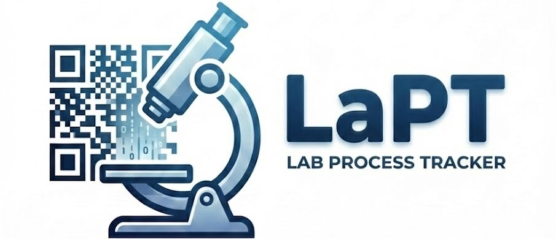

<div align="left">
  
</div>

# Lab Process Tracker

A tracking application for lab operations with a graphical user interface.
Track processes and sample scans using QR code input, with logs saved to CSV files.

## Start the tracker

After downloading the repository from GitHub, you can run the tracker in multiple ways:

### 1. Run the standalone executable

Navigate to the `exe/dist` folder and double-click the executable:
- **`process_tracker_gui_v<version>.exe`**

### 2. Run the GUI from source

```bash
python src/process_tracker_gui.py
```

No additional installations are required.

## How to use
**Sample/Process Tracking:**
1. **Enter your username**
  - Type your NLR username and click "Set" or press Enter
  - Use "Reset" button to change users

2. **Scan a PROCESS QR code** to set the tool/process:
   - This must be done first before scanning any samples
   - The first process scanned determines the log file name
     (e.g., `scan_log_c215ss_jv.csv`)
   - Valid processes are defined in `tools_processes.json`

3. **Scan SAMPLE QR codes** to log samples under the current process

4. **Switch between processes:**
   - When you scan a new process QR, your current records are saved automatically
   - You will see a notification showing how many records were saved
   - The new process is logged and you can start scanning more samples

**Tray/Platen Tracking:**
- Enter your NLR username as before
- Scan a tray QR code to enter tray mode
- Scan samples according to their position indicated in the tray mode window
  (A1, A2, B1, B2...)
- You can skip individual positions or skip all remaining positions
- Once all positions are filled or skipped, scan a s0ingle process QR code to associate
  and log all samples with that process
- Repeat for as many trays you have, logging sample positions and associating a process
  with each tray of samples
- Scan the load QR code to log time time all trays are loaded

 **Command buttons:**
   - `UNDO` — Remove the last scan from the session
   - `SAVE` — Save current session scans
   - `RESET` — Change the user
   - `EXIT` — Exit the tracker (prompts to save if there are unsaved scans)

**QR Code Format:**
- Process QR codes must contain: `P%:abbreviated_name` (e.g., `P%:c215ss_jv`)
- Sample QR codes must contain: `S%:SampleID` (e.g., `S%:2511-09`)
- Batch QR codes must contain: `B%:BatchID` (e.g., `B%:BATCH2025-001`)
- Tray QR codes must contain: `T%:TrayID` (e.g., `T%:072266-S-002`)
- The prefixes (`P%:`, `S%:`, `B%:`, and `T%:`) must be uppercase and include the colon
- Process names are case-insensitive (automatically normalized to lowercase)
- Sample IDs and Batch IDs preserve their original case
- Legacy sample QR codes in format `####-##` (e.g., `2511-09`) are supported
  - A warning will be displayed when legacy format is detected
  - No `S%:` prefix required for legacy samples

**Batch vs Sample Logging:**
- **Sample scanning:** Used to log individual samples processed through a tool
- **Batch scanning:** Used to log that an entire batch of samples processed
  - The batch scan records that the whole batch went through this specific process
  - CSV logs contain separate `SampleID` and `BatchID` columns
  - Only one is populated per scan (mutually exclusive)

**Process Validation & Quarantine Logging:**

When you scan a process QR code (`P%:process_name`):

- If the process **is listed in `tools_processes.json`**:
  - The process is set and scans are logged to a dedicated CSV file
    (e.g., `scan_log_c215ss_jv.csv`).
  - The process block is color-coded and the activity log confirms the process/tool.

- If the process **is NOT listed in `tools_processes.json`**:
  - You will see a **WARNING** in the activity log and process block.
  - All scans for this process are logged in a **quarantine CSV file** named
    `scan_log_UNAPPROVED_<process_name>.csv` in `outputs/unapproved/`.
  - You can continue logging samples for this process, but records are kept separate
    from approved processes.
  - **Contact Rajiv.Daxini@nlr.gov** to request adding new processes to the database.

The quarantine logic allows rapid deployment on new systems without blocking workflow,
while ensuring unapproved processes are tracked and not mixed with approved logs.

## Output

- Logs are saved to tool-specific CSV files (e.g., `scan_log_c215ss_jv.csv`,
  `scan_log_bd8_xrd.csv`)
- **Multi-process sessions:** When you switch between different processes, the
  application automatically saves records to the appropriate file for each process
- Default output locations:
  - **Running from source:** `outputs/` folder in the project directory
  - **Running as executable:** `~/Documents/process_tracking_outputs/`
- If a log file already exists, new session outputs will be appended

## Key Files and Folders

- **`src/`** - Main application code
- **`exe/dist/`** - Standalone executable
- **`outputs/`** - Default output location for CSV logs (auto-created)
- **`tools_processes.json`** - Central database of all tools/processes
- **`tray_layouts.json`** - Tray position mappings
- **`scripts/`** - QR code generation, UWL population, and build utilities
- **`tests/`** - Test suite

## Requirements

- Python 3.10 or higher

All dependencies are managed via `pyproject.toml`.
No external dependencies required unless using optional features or development tools.

## For Developers

If you want to install and run the repository directly (for development or
customization), you can install it using pip:

```bash
pip install .
```

If you also want to install optional dependencies for building standalone executables
(using PyInstaller) or running tests (using pytest), use:

```bash
# Install build dependencies (PyInstaller)
pip install .[build]

# Install test dependencies (pytest, pytest-cov)
pip install .[test]

# Install all development dependencies (build + test)
pip install .[dev]
```

#### Building Executable

To build the standalone executable:

```bash
python scripts/create_exe.py
```

The executable will be created in `exe/dist/` directory:
- `process_tracker_gui_v<version>.exe` - GUI version (no console window)

**Note:** You need PyInstaller installed: `pip install .[build]`

#### Running Tests

To run the test suite:

```bash
# Using the test runner script
python scripts/run_tests.py

# Or directly with pytest
pytest tests/ -v

# With coverage report (requires pytest-cov)
pytest tests/ -v --cov --cov-report=term-missing --cov-report=html
```

**Note:** You need to install the test dependencies first: `pip install .[test]`

The test suite covers `tracker_utils.py` and `populate_uwl.py`. The GUI is
validated through manual testing and usage.

## Test Coverage

Test coverage reports are generated in `htmlcov/` after running tests.
See the terminal output for summary and open `htmlcov/index.html` for details.

## Generating QR Codes

Two scripts are provided for QR code generation:

- **`scripts/generate_test_qr_codes.py`** - Create test set with valid/invalid examples
- **`scripts/generate_custom_qr_codes.py`** - Template for generating your own QR codes

Run either script to generate labeled QR code images:
```bash
python scripts/generate_test_qr_codes.py
```

QR codes are saved to `test_qr_codes/` or `custom_qr_codes/` folders.

## Populating UWL Files

`scripts/populate_uwl.py` writes scan log timestamp and location data into the
corresponding UWL's "Time & Place" field, saving a copy of the UWL file.
The original file is never modified.

```bash
# Single UWL file
python scripts/populate_uwl.py
    --uwl path/to/2503_015.uwl
    --scan-log outputs/scan_log_bcp_ag_evap.csv
    --sample-id 2503-015
    --process bcp_ag_evap

# Auto-locate UWL from a directory by sample ID
python scripts/populate_uwl.py
    --uwl-dir path/to/uwl_files/
    --scan-log outputs/scan_log_bcp_ag_evap.csv
    --sample-id 2503-015
    --process bcp_ag_evap
    --output-dir ./populated/
```

Output is written to `{stem}_populated.uwl` in the same directory as the input
file (or `--output-dir` if specified). Note: The process name must match the process
object's name in the UWL file exactly.
